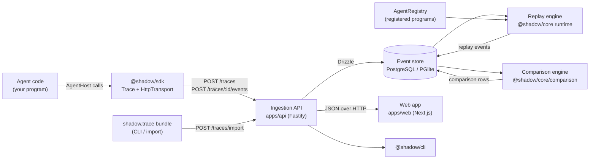

# Architecture overview

Shadow records AI-agent executions as append-only event logs, reconstructs what the agent knew
at any point, forks executions with typed overrides, replays them deterministically and compares
the branches. This document describes the packages, how data flows between them and the
boundaries each one is expected to respect.

## Data flow



1. **Record.** Agent code calls the `AgentHost` methods on a `Trace` (`tool`, `model`, `policy`,
   `context.set`, `state.set`, ...). The SDK turns each call into one or more events, redacts
   sensitive keys, batches them and sends them to the API with retries. Failures never propagate
   into agent code.
2. **Ingest.** The API validates every event against `@shadow/schemas`, assigns ids, sequences
   and timestamps that were omitted, redacts again on the server, appends the batch to the
   branch in one transaction, mirrors `state.snapshot` events into `state_snapshots`, updates
   trace lifecycle (status, outcome, duration), recomputes branch metrics and refreshes the search
   text.
3. **Inspect.** The web app and CLI read traces, effective event lineages, the execution tree and
   reconstructed state through the query endpoints. Reconstruction starts from the nearest
   snapshot and applies the state-mutating events up to the requested boundary.
4. **Fork.** A fork request names an event; the engine normalises it to an operation boundary,
   creates a child branch whose `forkSequence` is the last inherited sequence, stores the typed
   overrides and writes a `fork.created` event as the child's first event.
5. **Replay.** For a forked branch the API looks up the agent's program in the `AgentRegistry`,
   builds a replay plan from the parent lineage and executes it: the recorded prefix is served
   from history, state at the fork point is verified, overrides are applied, and the program
   continues against deterministic adapters. The resulting events are appended to the child
   branch.
6. **Compare.** Two branches of the same trace are compared: shared prefix, aligned suffixes,
   first divergence, tool/context/state diffs and metric deltas. The result is stored as a
   comparison row and rendered by the web app.

## Packages

| Package                    | Role                                                                                                                                                                                                                                            | Depends on                                                                                 |
| -------------------------- | ----------------------------------------------------------------------------------------------------------------------------------------------------------------------------------------------------------------------------------------------- | ------------------------------------------------------------------------------------------ |
| `@shadow/schemas`          | Zod schemas and types: events, entities, overrides, comparison, API bodies, `AgentHost` contract, schema version                                                                                                                                | `zod`                                                                                      |
| `@shadow/core`             | Engine: ids and clocks, JSON pointer/patch/diff, state store and reconstruction, event ordering and tree, branch lineage and forks, metrics and pricing, redaction, recording and replay runtime, history cursor, comparison, bundle validation | `@shadow/schemas`                                                                          |
| `@shadow/sdk`              | Instrumentation for agent code: `Shadow`, `Trace`, transports, client-side redaction                                                                                                                                                            | `@shadow/schemas`                                                                          |
| `@shadow/testkit`          | Deterministic adapters, replayable demo agents, synthetic load agent, demo data specs                                                                                                                                                           | `@shadow/core`, `@shadow/schemas`                                                          |
| `@shadow/cli`              | `shadow` command-line interface over the HTTP API                                                                                                                                                                                               | `@shadow/core`, `@shadow/schemas`, `commander`                                             |
| `@shadow/api` (`apps/api`) | Fastify service: config, database drivers, Drizzle schema and migrations, services, routes, replay registry, seed                                                                                                                               | `@shadow/core`, `@shadow/schemas`, `@shadow/testkit`, Fastify, Drizzle, PGlite, `pg`, pino |
| `@shadow/web` (`apps/web`) | Next.js 15 / React 19 / Tailwind 4 user interface                                                                                                                                                                                               | `@shadow/schemas`, API over HTTP                                                           |
| `@shadow/config`           | Shared TypeScript, ESLint and Prettier configuration                                                                                                                                                                                            | —                                                                                          |

### `@shadow/schemas`

The single source of truth for every shape that crosses a boundary. Key modules:

- `events.ts`: `eventSchema`, `ingestEventSchema`, `EVENT_TYPES`, payload schemas,
  `SPAN_OPENERS`, `shadowMetadataSchema`.
- `entities.ts`: project, agent, trace, branch, fork, replay, artifact, `branchMetricsSchema`.
- `state.ts`: JSON pointer, patch operations, snapshot/patch payloads, `reconstructedStateSchema`,
  `diffEntrySchema`.
- `overrides.ts`: the discriminated union of override kinds.
- `comparison.ts`: `comparisonResultSchema` and its parts.
- `api.ts`: request bodies, query schemas, page shape, error envelope, `traceExportSchema`.
- `host.ts`: `AgentHost`, `AgentProgram`, `ToolCall`, `ModelCall`, `PolicyCall` and related
  interfaces (types only).
- `version.ts`: `SCHEMA_VERSION`, `isCompatibleSchemaVersion`.

### `@shadow/core`

Pure logic with no I/O. Notable entry points:

- `runtime/host.ts` `RuntimeHost`: implements `AgentHost` for recording and replay.
- `runtime/run.ts` `recordExecution`: run a program from the start and produce a complete
  root-branch trace (used by seeds and tests).
- `runtime/replay.ts` `createReplay` / `executeReplay`: build and execute a replay plan.
- `runtime/history.ts` `HistoryCursor`: serves the recorded prefix during replay.
- `state/reconstruct.ts` `reconstructState`, `stateAround`.
- `branches/lineage.ts` `effectiveEvents`, `resolveLineage`, `sharedPrefixSequence`.
- `branches/fork.ts` `resolveForkPoint`, `createFork`.
- `comparison/compare.ts` `compareBranches`.
- `metrics/aggregate.ts` `aggregateMetrics`; `metrics/pricing.ts` `PricingProvider`.
- `redaction/redact.ts` `createRedactor`.
- `bundle/bundle.ts` `parseBundle`, `regenerateBundleIds`.

### `apps/api`

- `config.ts` loads `.env` and validates environment variables.
- `db/client.ts` chooses PGlite or PostgreSQL from `DATABASE_URL` and exposes a
  `DatabaseHandle`; `db/schema.ts` is the Drizzle schema; `drizzle/` holds migrations.
- `services/*` contain the business logic (traces, events, branches, comparisons, transfer,
  projects, search) and are called by thin route handlers in `http/routes/*`.
- `replay/registry.ts` holds the `AgentRegistry` of replayable programs; by default it contains
  the testkit scenarios.
- `seed/seed.ts` records, forks, replays and compares the demo traces deterministically.

## Package boundaries

The dependency direction is strict and enforced by workspace dependencies:

```
schemas  <-  core  <-  testkit  <-  api
   ^          ^                      ^
   |          +------- cli           |
   +---------- sdk                   |
   +---------- web  -----------------+ (HTTP only)
```

Rules:

- **`schemas` has no runtime dependencies besides Zod.** It never imports from another Shadow
  package.
- **`core` has no I/O.** No database, no HTTP, no file system, no timers. Time comes from a
  `Clock`, ids from an `IdGenerator`, persistence from a `sink` callback. This is what makes
  replay deterministic and the engine testable in isolation.
- **`sdk` does not depend on `core`.** It re-implements the small amount of pointer logic it needs
  so that agent processes do not load the engine.
- **`api` owns persistence.** Only the API talks to the database; the engine receives and returns
  plain event arrays.
- **`web` and `cli` talk to the API over HTTP** using the request and response shapes from
  `schemas`. They do not access the database.
- **Replayable programs are registered in the API process.** The engine never loads code from a
  trace or bundle.

## Determinism building blocks

Several pieces exist only to make results reproducible:

- `VirtualClock` advances only when the runtime tells it to (by the latency reported by adapters),
  so timestamps and durations are a function of the program, not of the machine.
- `seededIdGenerator(seed)` derives ids from a seed and a counter (FNV-1a based). Seeds use it
  for demo data; replay seeds it with the branch and replay ids.
- Adapters in `@shadow/testkit` are pure functions of their inputs (the scripted model picks its
  reply from `parameters.step`).
- The `HistoryCursor` verifies that the program reproduces the recorded prefix before any override
  is applied.

## Where to read next

- [Storage](./storage.md): tables, indexes, snapshots and the scaling path.
- [API](./api.md): route reference.
- [Events](../concepts/events.md), [State and context](../concepts/state-and-context.md),
  [Forks and overrides](../concepts/forks-and-overrides.md),
  [Replay modes](../concepts/replay-modes.md),
  [Branch comparison](../concepts/branch-comparison.md).
- [ADRs](../adr/README.md) for the reasoning behind these choices.
